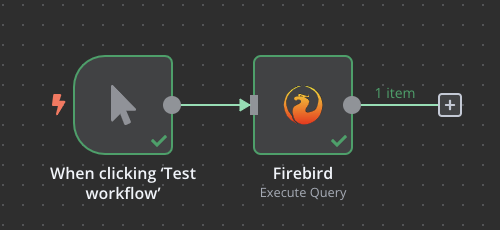

# n8n-nodes-firebird

This is an n8n community node. It lets you run queries on the firebird database.

**What is Firebird?**  
Firebird is an open-source relational database management system (RDBMS) that supports many ANSI SQL standard features.

[n8n](https://n8n.io/) is a [fair-code licensed](https://docs.n8n.io/reference/license/) workflow automation platform.

[Installation](#installation)  
[Operations](#operations)  
[Credentials](#credentials)
[Compatibility](#compatibility)  
[Resources](#resources)  

## Installation

Follow the [installation guide](https://docs.n8n.io/integrations/community-nodes/installation/) in the n8n community nodes documentation.

## Operations

There is only one node in this package capable of interacting with below operations:

- Query
- Insert
- Update

## Credentials

This node uses standard username / password based auth, so you will need to configure the credentials in the n8n.

## Compatibility

This node is tested to connect to firebird version `2.5` and n8n version `1.69.0`

## Resources

* [n8n Community Nodes Documentation](https://docs.n8n.io/integrations/community-nodes/)
* [Firebird Documentation](https://firebirdsql.org/en/firebird-rdbms/)

